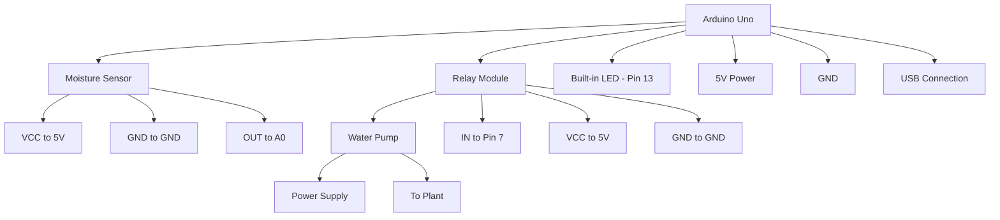

# Circuit Schematic

```mermaid
graph TD
    A[Arduino Uno] --> B[Moisture Sensor]
    A --> C[Relay Module]
    C --> D[Water Pump]
    A --> E[Built-in LED - Pin 13]
    
    B --> B1[VCC to 5V]
    B --> B2[GND to GND]
    B --> B3[OUT to A0]
    
    C --> C1[IN to Pin 7]
    C --> C2[VCC to 5V]
    C --> C3[GND to GND]
    
    D --> D1[Power Supply]
    D --> D2[To Plant]
    
    A --> A1[5V Power]
    A --> A2[GND]
    A --> A3[USB Connection]
```